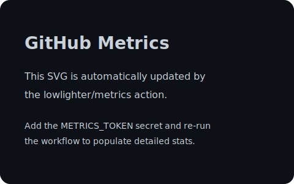

# Hi, I'm Pengchao Zhang 👋

I am a postdoctoral researcher at the Center for Combustion Energy, Department of Energy and Power Engineering, Tsinghua University. My work investigates how interfacial ion distributions steer physicochemical phenomena and how machine learning accelerates enhanced-sampling molecular dynamics. This repository powers my GitHub profile and curates my academic highlights alongside open-source activities.

## 📄 Curriculum Vitae

### Education
- **Ph.D. in Energy and Power Engineering**, Center for Combustion Energy, Tsinghua University (2020–2025)
- **B.Eng. in Energy and Power Engineering**, School of Energy and Power Engineering, Huazhong University of Science and Technology (2016–2020)

### Professional Experience
- **Postdoctoral Researcher**, Center for Combustion Energy, Department of Energy and Power Engineering, Tsinghua University (2025–Present)

### Other Roles
- *None at the moment*

## 🔬 Research Focus
My interests center on ion distributions at aqueous interfaces, the coupling between interfacial phenomena and physicochemical processes, and enhanced-sampling molecular dynamics accelerated by artificial intelligence.

### Recent Representative Publications
1. Pengchao Zhang, Chen Chen, Mingliang Feng, Chao Sun*, Xuefeng Xu*. Hydroxide and hydronium ions modulate the dynamic evolution of nitrogen nanobubbles in water. *Journal of the American Chemical Society*. 2024, 146(28), 19537–19546. DOI: [10.1021/jacs.4c03118](https://doi.org/10.1021/jacs.4c03118)
2. Pengchao Zhang, Mingliang Feng, Xuefeng Xu*. Double-layer distribution of hydronium and hydroxide ions in the air-water interface. *ACS Physical Chemistry Au*. 2024, 4(4), 336–346. DOI: [10.1021/acsphyschemau.3c00224](https://doi.org/10.1021/acsphyschemau.3c00224)
3. Pengchao Zhang, Austin T. Gardini, Xuefeng Xu*, Michele Parrinello*. Intramolecular and water mediated tautomerism of solvated glycine. *Journal of Chemical Information and Modeling*. 2024, 64(9), 3599–3604. DOI: [10.1021/acs.jcim.4c00227](https://doi.org/10.1021/acs.jcim.4c00227)
4. Pengchao Zhang, Xuefeng Xu*. Propensity of water self-ions at air(oil)-water interfaces revealed by deep potential molecular dynamics with enhanced sampling. *Langmuir*. 2025, 41(5), 3675–3683. DOI: [10.1021/acs.langmuir.4c02746](https://doi.org/10.1021/acs.langmuir.4c02746)
5. Pengchao Zhang, Xuefeng Xu*. Modulation of electric field and interface on competitive reaction mechanisms. *Journal of Chemical Theory and Computation*. 2025, 21(13), 6584–6593. DOI: [10.1021/acs.jctc.5c00421](https://doi.org/10.1021/acs.jctc.5c00421)

## 📊 Open-Source & Research Metrics

The metrics panel above is generated by the [lowlighter/metrics](https://github.com/lowlighter/metrics) GitHub Action. Configure the following repository secrets to activate scheduled updates:
- `METRICS_TOKEN`: fine-grained personal access token with the `public_repo` scope (or `repo` for private repositories)
- `SCHOLAR_TOKEN`: token obtained from the [scholar plugin documentation](https://github.com/lowlighter/metrics/tree/master/source/plugins/scholar)

👇 Explore my publication updates at [Zhang-pchao/research](https://github.com/Zhang-pchao/research).
